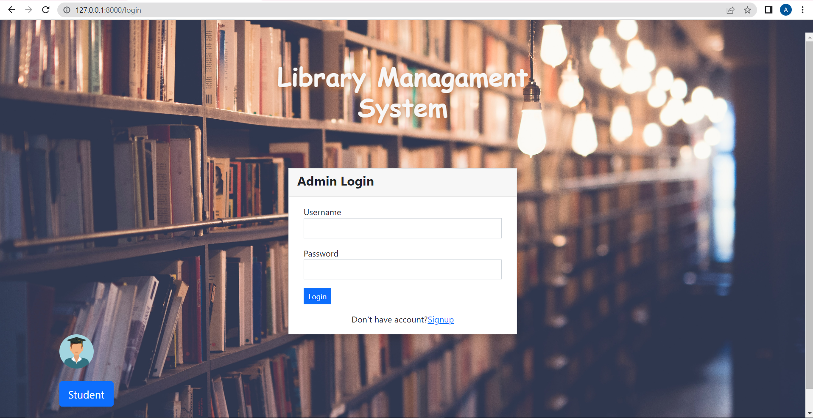
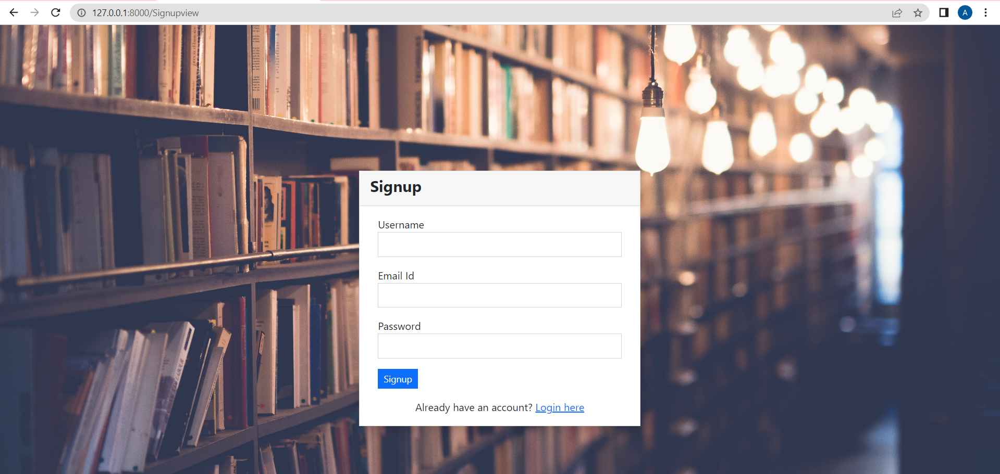
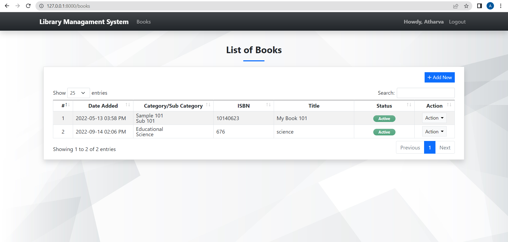
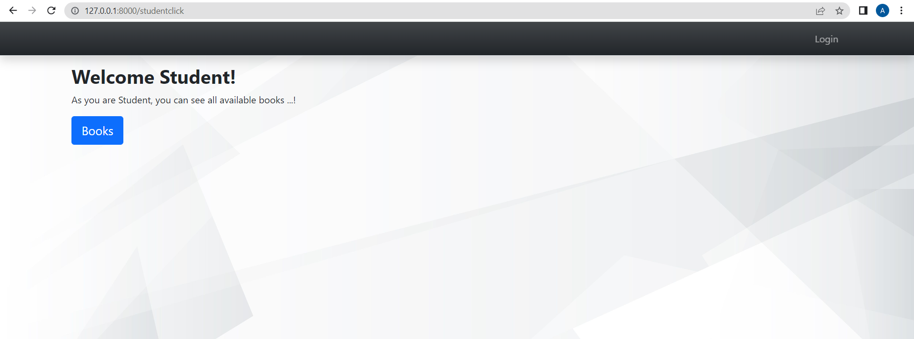
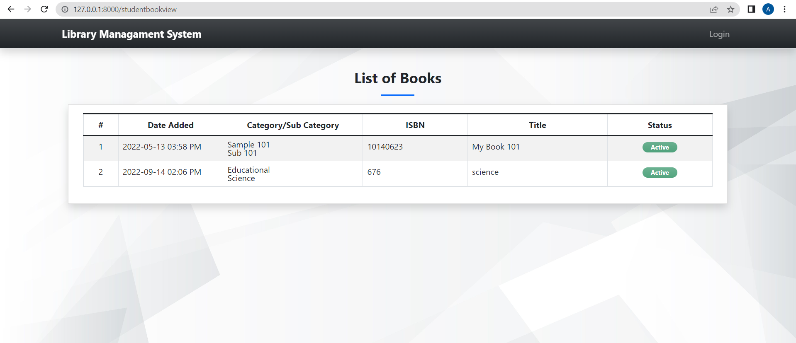

# library-management-system

---
## screenshots
### Login Page

### Signup page

### Admin Dashboard

### All available Book

### Student View

### Student Book view

---
### Admin account details
Username - Atharva
password - 123@ath

## Functions
### Admin
- Create Admin account and Login.
- Can Add, View, Delete, Update Books.
- Can retrieve all the books.

### Student
- Can view all the records of book
---

## HOW TO RUN THIS PROJECT
- Install Python(3.10.0) (Dont Forget to Tick Add to Path while installing Python)
- Open Terminal and Execute Following Commands :
```
python -m pip install -r requirements. txt
```
- Download This Project Zip Folder and Extract it
- Move to project folder in Terminal. Then run following Commands :
```
py manage.py makemigrations
py manage.py migrate
py manage.py runserver
```
- Now enter following URL in Your Browser Installed On Your Pc
```
http://127.0.0.1:8000/
```


## Drawbacks/LoopHoles
- Anyone can be Admin.

## Feedback
Any suggestion and feedback is welcome.
